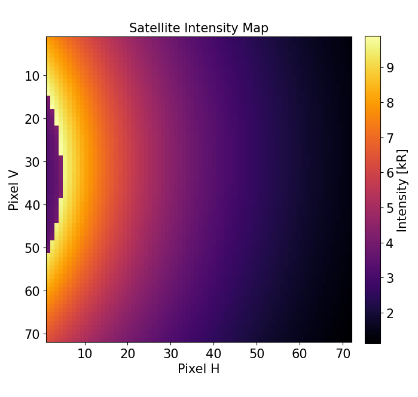

# Exosphere-3D Simulator 🌎️

Refactored from original ExoSpy example4.ipynb.
Original repo:

```
@software{EXOSpy2022,
author={Cucho-Padin, G. and Bhattacharyya, D. and Sibeck, D. and Connor, H. and Youngblood, A. and Ardila, D.},
title={{EXOSpy}: Initial Release},
month=October,
year=2022,
publisher={Zenodo},
version={v2.3.0},
doi={10.5281/zenodo.7240590},
url={https://doi.org/10.5281/zenodo.7240590}
}
```

[Original Exospy repo here](https://github.com/gcucho/EXOSpy/tree/v3.0.0).

## 🚀 Features

+ Modular Architecture: Clean separation of configuration, simulation, and visualization
+ Single Satellite Mode: Streamlined for one satellite imaging
+ Customizable Parameters: All satellite parameters configurable in main.py
+ Professional Visualizations: 2D intensity maps and 3D geometry plots
+ Easy to Extend: Object-oriented design for future enhancements

## 📋 Installing

Using pip
```
pip install requirements.py
```
or
```
pip install -e .
```

### 🚨 Exospy error

If you experience an error in the exospy module
```
File ".../exospy.py", line 929, in generateIntensityOpticallyThin
    Intensity_v[i,0] = intensity
    ~~~~~~~~~~~^^^^^
ValueError: setting an array element with a sequence.
```

simply modify line 929 of ```generateIntensityOpticallyThin``` as
```
Intensity_v[i,0] = intensity[0]
```

## 📊 Example 

```
python3 main.py
```

<p align="center">
  
</p>
Figure 1.

<p align="center">
  
</p>
Figure 2.
